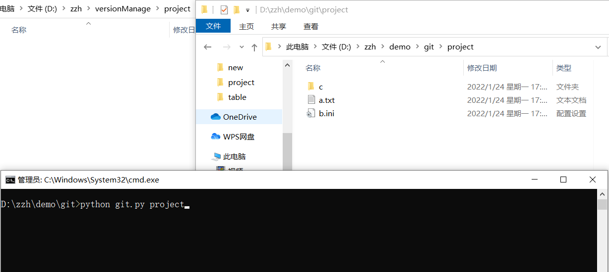
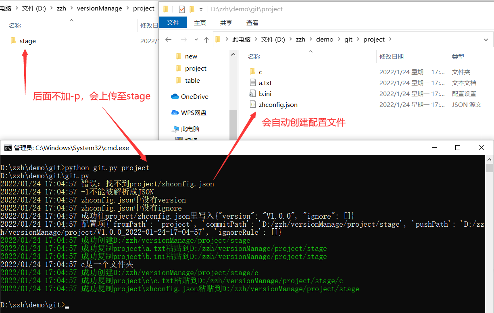
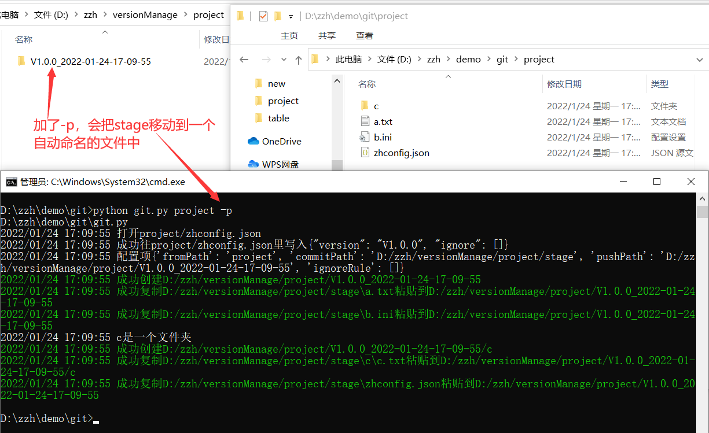
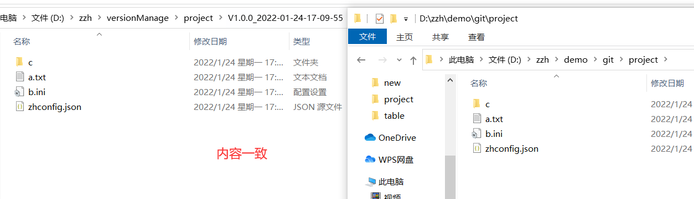
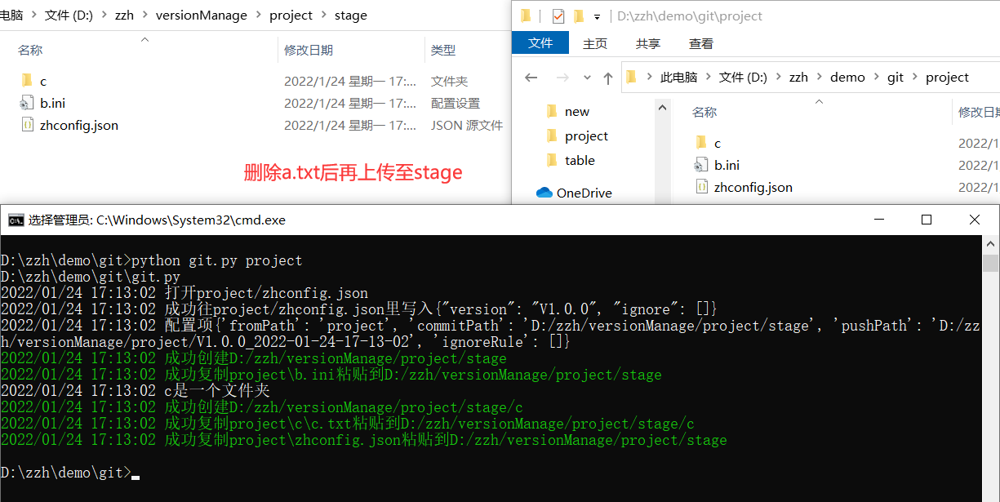
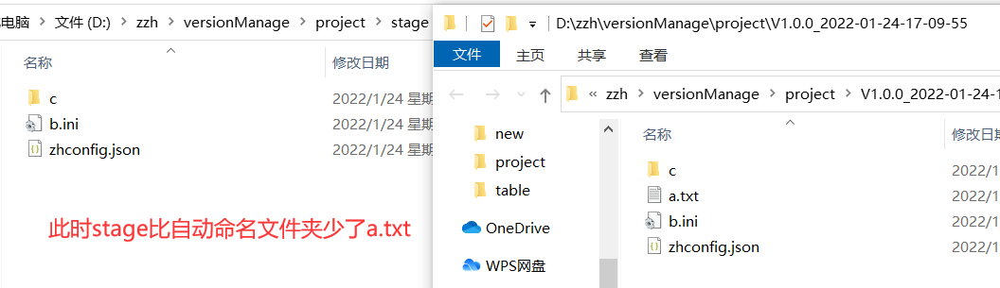
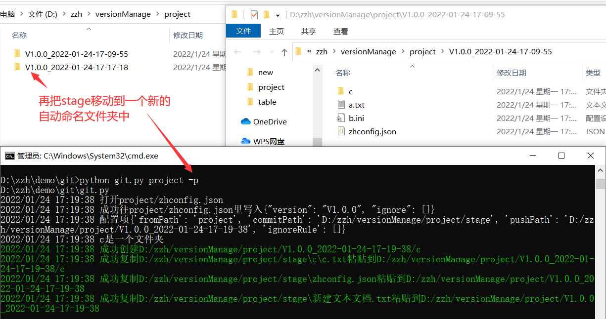
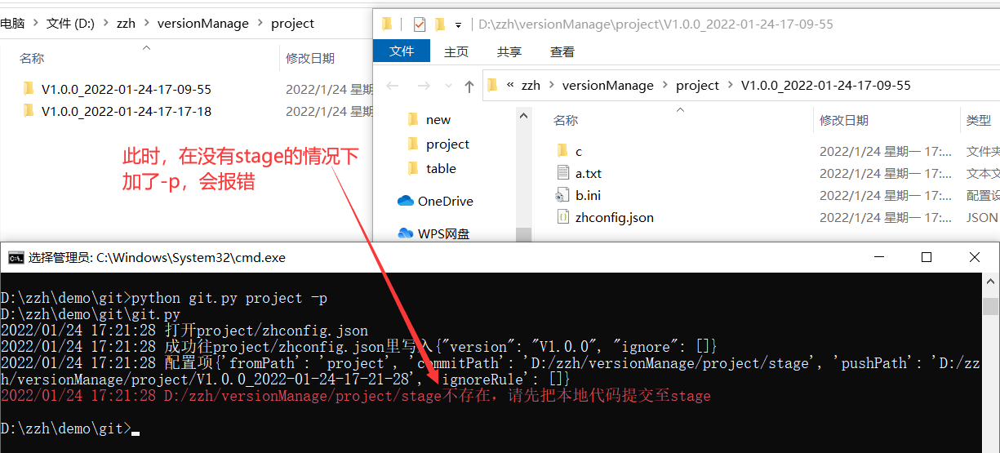

# Live

## Project Introduction

临时写的一个版本管理工具（仿git）
尚未完成：上传服务器，冲突管理

要用的话，可以直接下在zh.exe
然后把它添加进环境变量，在命令行中使用它
```
zh -h
```
上述命令用于查看帮助手册

## API
格式
```
python git.py 项目文件夹 命令类型
```
注：在项目文件夹所在的目录中（不是项目所在的目录中），使用终端工具，运行命令

把project文件夹复制到stage中
```
python git.py project
```

把stage文件夹移动到V1.0.0_2022-01-25-14-40-46中
```
python git.py project -s
```

查看project项目中所有submit记录
```
python git.py project -l
```

拉取submit记录中的项目
```
python git.py D:/zzh/versionManage/project/V1.0.0_2022-01-25-14-40-46 -c
```

删除project项目中所有的add和submit
```
python git.py project -r
```

## Project Picture
（图是旧的，还没更新）















